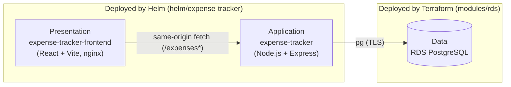
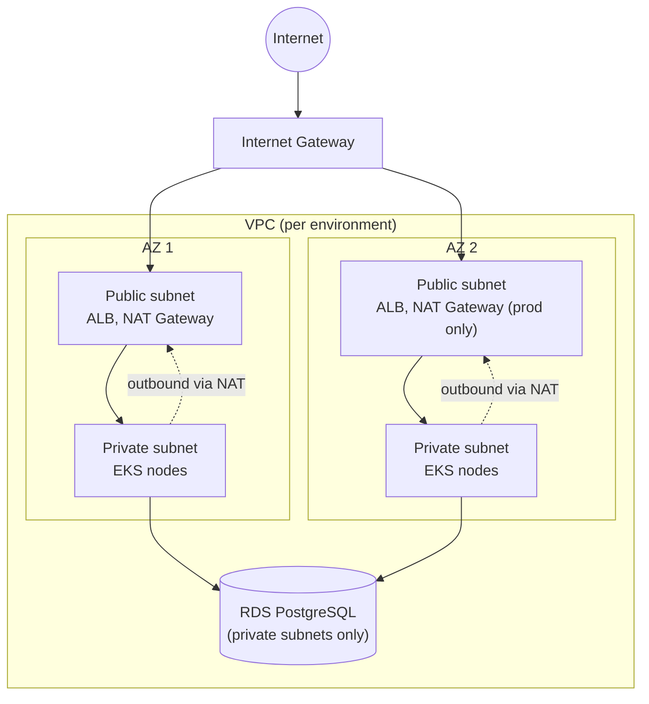
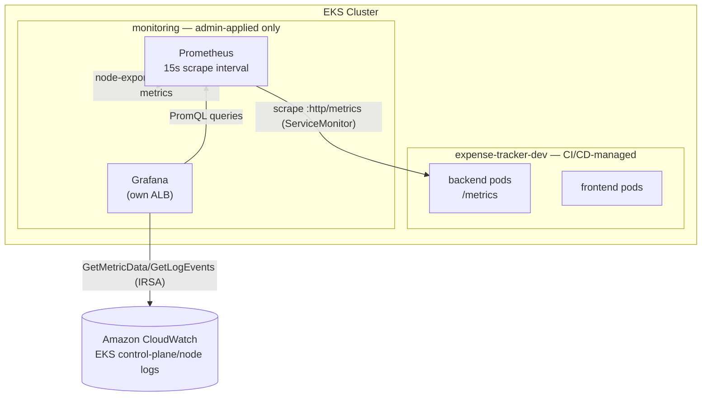

# Expense-Tracker App

Expense-Tracker is a cloud-native expense and receipt tracking platform running on Amazon EKS.
It demonstrates a complete, production-style workflow spanning infrastructure as code,
Kubernetes deployment, CI/CD automation, and observability.

---

## Table of Contents

- [Architecture Design](#architecture-design)
- [Application Design](#application-design)
- [Networking Design](#networking-design)
- [Data Flow](#data-flow)
- [Setup & Deployment](#setup--deployment)
- [CI/CD Pipeline](#cicd-pipeline)
- [Security](#security)
- [Observability](#observability)
- [Known Gaps](#known-gaps)
- [Troubleshooting](#troubleshooting)
- [Teardown](#teardown)

---

## Architecture Design

### Core Components

| Component | Detail |
|---|---|
| **Amazon EKS 1.36** | Managed control plane, `API_AND_CONFIG_MAP` auth mode |
| **VPC** | 2 AZs, public + private subnets, NAT gateway (per-environment strategy) |
| **EKS Managed Node Group** | Amazon Linux, capacity/sizing per environment |
| **`app/expense-tracker-backend`** | Node.js + Express API |
| **`app/expense-tracker-frontend`** | React + Vite UI, nginx-served |
| **RDS PostgreSQL** | Private, one instance per environment, AWS-managed master password |
| **S3 app bucket** | Versioned, encrypted, TLS-only, holds uploaded receipts |
| **2 ECR repositories per environment** | `expense-platform-backend-<env>`, `expense-platform-frontend-<env>` |
| **Helm chart** | `helm/expense-tracker`, one release for both services |
| **CI/CD** | `.github/workflows/build-and-deploy.yml` |
| **Monitoring** | `monitoring/` (Prometheus + Grafana + CloudWatch datasource) |

This is a 3-tier application, split across two tools by design — not a gap, just where each tier
is deployed from:

| Tier | What | Deployed by |
|---|---|---|
| Presentation | `app/expense-tracker-frontend` (React + Vite, nginx-served) | Helm (`helm/expense-tracker`) |
| Application | `app/expense-tracker-backend` (Node.js + Express) | Helm (`helm/expense-tracker`) |
| Data | RDS PostgreSQL | Terraform (`modules/rds`) |

RDS was deliberately kept as a managed service rather than a self-hosted `StatefulSet` in the
cluster — it gives AWS-managed backups, patching, and (in prod) Multi-AZ failover for free, and
the strongest drift-detection story (`terraform plan` diffs the actual `aws_db_instance` resource
attribute-by-attribute). Self-hosting Postgres in Kubernetes would mean owning all of that
operationally, for no scaling benefit this app actually needs.



### Compute

- One EKS managed node group per environment, spanning both private subnets (`modules/eks`).
- **Namespaces**: `expense-tracker-<env>` runs the app (backend + frontend + migration Job);
  `kube-system` runs cluster add-ons; `monitoring` runs Prometheus/Grafana.
- The app's namespace is created by Terraform (`kubernetes_namespace.app`), not by Helm — see
  [Security](#security) for why.
- **Scaling**: three independent layers. Cluster Autoscaler adds/removes EC2 nodes as pod demand
  changes; a `HorizontalPodAutoscaler` per service (backend/frontend, CPU-based, disabled in dev,
  enabled in stg/prod — `helm/expense-tracker/templates/backend-hpa.yaml` /
  `frontend-hpa.yaml`) adds/removes pod replicas within the node group's capacity; the ALB and S3
  scale automatically with no configuration. RDS storage also auto-grows up to
  `rds_max_allocated_storage` as usage approaches the current limit — the one part of the stack
  that doesn't self-heal under growth otherwise.

### Data layer

- **RDS PostgreSQL** — `gp3`-backed, sizing/Multi-AZ varies per environment, security group scoped
  to the EKS node security group only (`modules/rds`).
- **S3 app bucket** — receipts stored under `<env>/receipts/`.
- **Secrets Manager** — one placeholder secret per environment; Terraform never writes to it after
  creation (`lifecycle { ignore_changes = [secret_string] }`), so the app team can populate real
  values without Terraform reverting them.
- **ECR** — two repositories per environment (see above), IMMUTABLE tags, scan-on-push, lifecycle
  policy expiring old untagged/excess-tagged images.

### Terraform layout

- **`bootstrap/`** — one-time, local-state module creating the S3 state bucket. Applied manually,
  once per AWS account, before anything else.
- **`modules/`** — reusable building blocks: `vpc`, `eks`, `eks-addons`, `irsa`, `ecr`, `rds`,
  `s3-app-bucket`, `secrets-manager`, `cloudwatch`, `ci-deployer`. `vpc` and `eks` wrap the
  `terraform-aws-modules/vpc/aws` and `terraform-aws-modules/eks/aws` registry modules.
- **`environments/{dev,stg,prod}/`** — one root module per environment; identical files, different
  `terraform.tfvars` (CIDR, NAT strategy, node/RDS sizing, log retention).

### Environments

| | dev | stg | prod |
|---|---|---|---|
| NAT gateway | single | single | one per AZ |
| Node capacity type | SPOT | ON_DEMAND | ON_DEMAND |
| Node group size (min/max/desired) | 1/3/2 | 2/4/2 | 3/10/4 |
| RDS instance class | `db.t3.micro` | `db.t3.small` | `db.r6g.large` |
| RDS storage (start → max) | 20 → 50 GiB | 20 → 50 GiB | 100 → 500 GiB |
| RDS Multi-AZ | no | no | yes |
| RDS deletion protection | no | no | yes |
| Log retention | 7 days | 14 days | 90 days |
| Frontend/backend replicas | 1 / 1 (fixed) | 2–4 (HPA) | 3–6 (HPA) |

Only `dev` has been deployed and verified end-to-end so far; `stg`/`prod` are defined but not yet
applied.

---

## Application Design

The three pieces named in the Architecture Design tiers above, in detail.

### Backend (app/expense-tracker-backend)

Node.js + Express, using `pg` for Postgres and the AWS SDK v3 for S3/Secrets Manager.

| Method | Path | Purpose |
|---|---|---|
| `POST` | `/expenses` | Create an expense (multipart form, optional receipt upload) |
| `GET` | `/expenses` | List expenses (filter by `category`/`month`) |
| `GET` | `/expenses/:id` | Get one expense, with a presigned receipt URL if uploaded |
| `PUT` | `/expenses/:id` | Update an expense, optionally replacing the receipt |
| `DELETE` | `/expenses/:id` | Delete an expense and its receipt object |
| `GET` | `/expenses/summary` | Totals grouped by category and month |
| `GET` | `/healthz` | Liveness/readiness probe target |
| `GET` | `/metrics` | Prometheus exposition format (`prom-client`) |

On boot, the app fetches its DB credentials from the RDS-managed Secrets Manager secret using its
pod's IRSA role — no database password ever touches Terraform state or a Kubernetes Secret.
Schema migrations (`src/migrate.js`) run as a Helm `post-install,post-upgrade` hook.

### Frontend (app/expense-tracker-frontend)

React 18 + Vite, built to a static bundle and served by nginx. Talks to the API with **same-origin
relative fetches** (`fetch("/expenses")`) — no API base URL or CORS configuration needed, since
both services sit behind the same ALB. Supports creating, editing, deleting, and summarizing
expenses, with receipt upload/replace.

### Helm chart (helm/expense-tracker)

One chart, one release per environment, both services:

- `backend-serviceaccount.yaml` — annotated with the app's IRSA role ARN
- `backend-configmap.yaml` — non-secret config (DB host/port, S3 bucket, region)
- `backend-deployment.yaml` / `backend-service.yaml` — backend
- `frontend-deployment.yaml` / `frontend-service.yaml` — frontend
- `ingress.yaml` — one ALB, path-split between the two Services
- `backend-migration-job.yaml` — a `post-install,post-upgrade` hook (Job specs are immutable, so a
  plain `helm upgrade` can't patch one in place once the image tag changes — the hook deletes the
  previous Job and creates a fresh one instead)

`values.yaml` holds chart defaults; `values-<env>.yaml` carries environment-specific values
(image repository/tag, replica count, IRSA role ARN, RDS endpoint, S3 bucket). See
[`helm/expense-tracker/README.md`](helm/expense-tracker/README.md) for install/upgrade commands.

---

## Networking Design

### Per-environment layout

| | dev | stg | prod |
|---|---|---|---|
| VPC CIDR | `10.0.0.0/16` | `10.1.0.0/16` | `10.2.0.0/16` |
| AZs | 2 | 2 | 2 |
| Private subnets | `10.0.0.0/19`, `10.0.32.0/19` | `10.1.0.0/19`, `10.1.32.0/19` | `10.2.0.0/19`, `10.2.32.0/19` |
| Public subnets | `10.0.64.0/19`, `10.0.96.0/19` | `10.1.64.0/19`, `10.1.96.0/19` | `10.2.64.0/19`, `10.2.96.0/19` |
| NAT gateway | single (shared) | single (shared) | one per AZ |

Each environment gets its own VPC (`modules/vpc`) — no peering or shared networking between
environments. Prod's per-AZ NAT gateways mean a single AZ outage doesn't take down all outbound
traffic (patching, ECR pulls, Secrets Manager calls); dev/stg accept that risk for lower cost.

### Security group boundaries

| Security group | Attached to | Allows inbound from |
|---|---|---|
| Cluster SG | EKS control plane | Node SG (kubelet/webhook ports) |
| Node SG | EKS worker nodes | Cluster SG (control plane), self (pod-to-pod: CoreDNS, webhooks) |
| RDS SG | RDS instance | Node SG only, on `5432` (`modules/rds`) — nothing else in the VPC, and nothing outside it, can reach the database |

### Ingress routing

One ALB per environment (AWS Load Balancer Controller, provisioned from
`helm/expense-tracker/templates/ingress.yaml`), shared by both services so the frontend can call
the API same-origin with no CORS configuration:

| Path | Routes to | Purpose |
|---|---|---|
| `/expenses*` | backend Service | REST API |
| `/healthz` | backend Service | ALB target-group health check |
| `/` (everything else) | frontend Service | Static SPA bundle |

### Topology



---

## Data Flow

### Request flow (read/write an expense)

```
Browser
  |
  |  HTTP GET /
  ▼
ALB (Ingress)
  |
  |  Rule: /*  →  frontend service
  ▼
Frontend Pod (nginx)
  |
  |  Serves static SPA bundle
  |
  |  Browser JS calls fetch /expenses* (same-origin)
  ▼
ALB (Ingress)
  |
  |  Rule: /expenses*, /healthz  →  backend service
  ▼
Backend Pod (Express)
  |
  ├─▶ Secrets Manager (IRSA)      — fetch DB credentials, no static creds
  ├─▶ RDS Postgres (pg, TLS)      — query/insert expense records
  └─▶ S3 receipts bucket (IRSA)   — upload on create, presigned URL on read
```

### Image Delivery Flow

```
GitHub Push to main
  |
  ▼
GitHub Actions
  |  test              — npm ci && npm test
  |  build-and-push    — docker build → docker push (backend + frontend)
  ▼
ECR (private)
  |  <account_id>.dkr.ecr.<region>.amazonaws.com/
  |  ├─▶ expense-platform-backend-<env>:backend-<env>-<timestamp>
  |  └─▶ expense-platform-frontend-<env>:web-<env>-<timestamp>
  ▼
deploy job                       — bumps both tags in values-<env>.yaml, commits back to main
  |
  ▼
helm upgrade --install
  |
  ├─▶ migration Job hook         — runs against RDS
  └─▶ Deployment rollout         — kubelet pulls the new images via the node's IAM role
```

### Secret Injection Flow

```
AWS Secrets Manager
  |  rds!db-<generated>                  (RDS-managed)  — { username, password }
  ▼
External Secrets Operator (helm-installed, terraform-managed release)
  |  SecretStore (backend-secretstore.yaml) — auth via serviceAccountRef,
  |  reusing the app's own IRSA role (expense-platform-<env>-app), no
  |  standing AWS permissions on the shared ESO controller itself
  |  ExternalSecret (backend-externalsecret.yaml) — polls every
  |  externalSecrets.refreshInterval (default 1m)
  ▼
Kubernetes Secret (expense-tracker-<env>-db-credentials)
  ▼
Backend Pod
  |  envFrom secretRef — DB_USERNAME / DB_PASSWORD set at container start
  ▼
pg connection pool (src/db.js)
```

### Metrics & Logs Flow

```
Backend Pod
  |  /metrics endpoint (prom-client)
  ▼
Prometheus (ServiceMonitor scrapes every 15s)
  |  stores in PVC (gp3, 10Gi, 15d retention)
  ▼
Grafana (Prometheus datasource)
  |  App Dashboard      — request rate, latency, errors
  |  Platform Dashboard — node CPU/memory, pod counts (built in)

EKS control plane + nodes
  |  amazon-cloudwatch-observability add-on (fluent-bit + CloudWatch agent)
  ▼
CloudWatch Logs & Container Insights
  ▼
Grafana (CloudWatch datasource, via IRSA — module.irsa_grafana_cloudwatch)
  └─▶ CloudWatch Dashboard — Logs Insights queries, cross-referenced with Prometheus metrics
```

### Where data lives

| Data | Storage | Protection |
|---|---|---|
| Expense records | RDS PostgreSQL | Private subnets only, SG scoped to node SG, AWS-managed master password |
| Receipt files | S3 app bucket | Versioned, encrypted, TLS-only bucket policy, IRSA-scoped access (no public access) |
| DB credentials | Secrets Manager (AWS-managed) | Rotated by AWS, fetched at runtime via IRSA — never written to Terraform state or a Kubernetes Secret |
| App config (non-secret) | Kubernetes ConfigMap | DB host/port, S3 bucket name, region — no credentials |

---

## Setup & Deployment

### Project Structure

```
DevOps-Projects/
├── bootstrap/                       # One-time: S3 state bucket (local state)
├── modules/
│   ├── vpc/                         # Wraps terraform-aws-modules/vpc/aws
│   ├── eks/                         # Wraps terraform-aws-modules/eks/aws
│   ├── eks-addons/                  # vpc-cni, coredns, kube-proxy, ebs-csi, metrics-server, cloudwatch-observability
│   ├── irsa/                        # Generic IRSA role wrapper
│   ├── ecr/                         # ECR repository + lifecycle policy
│   ├── rds/                         # RDS Postgres instance + security group
│   ├── s3-app-bucket/               # App receipts bucket
│   ├── secrets-manager/             # Placeholder secret
│   ├── cloudwatch/                  # Log groups
│   └── ci-deployer/                 # Per-environment CI IAM user (scoped ECR push + EKS access)
├── environments/
│   ├── dev/  stg/  prod/            # One root module per environment
├── app/
│   ├── expense-tracker/             # Backend (Node.js + Express)
│   └── expense-tracker-frontend/    # Frontend (React + Vite)
├── helm/
│   └── expense-tracker/             # Helm chart for both services
├── .github/
│   └── workflows/
│       └── build-and-deploy.yml     # CI/CD pipeline
└── monitoring/                      # Prometheus + Grafana (manually helm-installed)
```

### Prerequisites

| Tool | Notes |
|---|---|
| Terraform | >= 1.5 |
| AWS CLI | configured with credentials that can create VPC/EKS/IAM/RDS/S3/ECR/Secrets Manager/CloudWatch resources |
| kubectl | any recent version |
| Helm | >= 3 |
| Docker | for local image builds |
| Node.js | 20+ (matches the app's runtime and CI) |
| Git | GPG signing configured if you want verified commits |

### 1. Bootstrap remote state (once per AWS account)

```bash
cd bootstrap
# edit terraform.tfvars: replace <ACCOUNT_ID> in state_bucket_name
terraform init
terraform apply
```

Keep `bootstrap/terraform.tfstate` safe — it describes the state bucket itself, so it isn't stored
remotely.

### 2. Apply an environment

```bash
cd environments/dev
# edit terraform.tfvars and backend-dev.hcl: replace <ACCOUNT_ID>
terraform init -backend-config=backend-dev.hcl
terraform plan
terraform apply
```

This creates the VPC, EKS cluster, RDS instance, ECR repos, S3 bucket, IRSA roles, EKS add-ons,
the `ci_deployer` CI user, and the app's Kubernetes namespace.

### 3. Wire up CI/CD

Create a matching GitHub Environment (`dev`/`stg`/`prod`) and set its secrets/variables from the
`environments/<env>` Terraform outputs. See
[`.github/workflows/README.md`](.github/workflows/README.md) for the exact list and commands.

### 4. Fill in the Helm values

`helm/expense-tracker/values-<env>.yaml` needs the real `image.repository`,
`frontend.image.repository`, `serviceAccount.roleArn`, `config.dbHost`, `config.dbSecretArn`, and
`config.s3Bucket` from the same Terraform outputs — the pipeline only ever bumps image tags, not
these. See [`helm/expense-tracker/README.md`](helm/expense-tracker/README.md).

### 5. First deploy

Push to `main` (or trigger `workflow_dispatch` targeting the environment) — CI builds and pushes
both images, then runs `helm upgrade --install`.

```bash
aws eks update-kubeconfig --name expense-platform-dev --region us-east-1
kubectl get pods -n expense-tracker-dev
kubectl get ingress -n expense-tracker-dev
```

### 6. Install monitoring (optional, per cluster)

```bash
cd monitoring
# see monitoring/README.md for the full sequence
```

---

## CI/CD Pipeline

`.github/workflows/build-and-deploy.yml`, three jobs:

1. **test** — `npm ci && npm test` in `app/expense-tracker-backend`.
2. **build-and-push** — builds and pushes both images to their ECR repos, tagged
   `backend-<env>-<timestamp>` (backend) / `web-<env>-<timestamp>` (frontend).
3. **deploy** — bumps both tags in `values-<env>.yaml` with `yq`, commits the change back to
   `main`, then runs `helm upgrade --install` against the target cluster.

Triggers: push to `main` deploys to `dev` automatically; `workflow_dispatch` lets you pick
`dev`/`stg`/`prod` manually. Each environment authenticates with its own scoped, Terraform-managed
IAM user (`modules/ci-deployer`) via GitHub Environment secrets — no shared or long-lived
cross-environment credentials.

## Security

Security is applied per layer, from the CI credential down to the running pod.

| Layer | Control |
|---|---|
| **CI/CD Credentials** | GitHub Actions authenticates via a static, per-environment IAM-user access key (`modules/ci-deployer`) stored as GitHub Environment secrets — no OIDC federation configured yet |
| **IAM / IRSA** | Least-privilege per workload: `irsa_vpc_cni`, `irsa_ebs_csi`, `irsa_cluster_autoscaler`, `irsa_lb_controller`, `irsa_cloudwatch_observability` (all `kube-system`), `irsa_app` (Secrets Manager + S3, scoped to the app namespace), `irsa_grafana_cloudwatch` (read-only CloudWatch, `monitoring` namespace) |
| **CI EKS Access** | `ci-deployer`'s EKS access entry is namespace-scoped (`AmazonEKSEditPolicy` restricted to `expense-tracker-<env>`) — it cannot create namespaces or reach `monitoring` or any cluster-scoped resource. A supplementary namespace-scoped `Role`/`RoleBinding` grants it CRUD on `external-secrets.io` resources, since that fixed AWS policy doesn't extend to CRDs |
| **Secrets** | External Secrets Operator syncs the RDS-managed Secrets Manager secret into a Kubernetes Secret via a `SecretStore` authenticated as the app's own IRSA role (no standing AWS access on the shared ESO controller); the app reads `DB_USERNAME`/`DB_PASSWORD` from that Secret, never calling the AWS SDK itself. The RDS master password is AWS-managed (`manage_master_user_password = true`) and never touches Terraform state |
| **Container Runtime** | Backend image runs as a non-root user (`USER app`, Alpine-based) |
| **Network** | RDS security group accepts inbound only from the EKS node security group, on `5432` — nothing else in or outside the VPC can reach it |
| **Data at Rest** | RDS, S3, ECR, and Secrets Manager each use their default AWS-managed encryption |
| **Data in Transit** | The backend's `pg` client connects over TLS; the S3 bucket policy denies any non-TLS request |
| **Image Integrity** | Both ECR repositories use `IMMUTABLE` tags with scan-on-push enabled |
| **Availability** | RDS Multi-AZ is configurable per environment (on in prod); the EKS node group spans both AZs |
| **CI Security Gates** | `npm test` runs before every build/push/deploy |

---

## Observability

Metrics live in a separate `monitoring` namespace, applied manually by a cluster admin
(`helm install`) rather than by CI/CD. This mirrors the same boundary enforced in
[Security](#security): `ci-deployer`'s EKS access is scoped to the app namespace only and cannot
reach `monitoring` or any cluster-scoped resource.



### Grafana Dashboards

| Dashboard | Metrics Covered |
|---|---|
| **Platform (built-in)** | Node CPU/memory, pod counts/restarts, cluster resource usage — from the chart's bundled node-exporter + kube-state-metrics |
| **Application (custom)** | Backend request rate, latency, and error metrics from `/metrics` (`prom-client`) — auto-imported via a sidecar-watched ConfigMap (`expense-tracker-app-dashboard-configmap.yaml`) |
| **Infrastructure (CloudWatch)** | RDS CPU/connections/storage/latency, ALB request count, 4xx/5xx errors, p99 response time, healthy/unhealthy host count — via `db_instance`/`loadbalancer` dropdown variables, not a fixed target (`cloudwatch-infra-dashboard-configmap.yaml`) |

### Prometheus Scrape Targets

| Job | Target | Metrics |
|---|---|---|
| Built-in (chart-managed) | kubelet / cAdvisor / kube-state-metrics | Node and cluster-wide resource metrics |
| `expense-tracker` | Backend Service, port `http`, path `/metrics`, every 15s (`servicemonitor-expense-tracker-<env>.yaml`) | HTTP request rate, latency, custom app metrics |

### Grafana Access

| | |
|---|---|
| **URL** | `kubectl get ingress -n monitoring` (own ALB, separate from the app's) |
| **Username** | `admin` |
| **Password** | Auto-generated by the chart into the `kube-prometheus-stack-grafana` Secret — never stored in this repo |

```bash
kubectl get secret -n monitoring kube-prometheus-stack-grafana \
  -o jsonpath="{.data.admin-password}" | base64 -d
```

CloudWatch is wired in as a second Grafana datasource via `irsa_grafana_cloudwatch`, surfacing
EKS control-plane/node-group log groups and metrics alongside Prometheus data in the same instance.

### Installing the Monitoring Stack

Applied once per cluster by a cluster admin, never by CI/CD — same `values.yaml` +
`values-<env>.yaml` layering as the Helm chart. See
[`monitoring/README.md`](monitoring/README.md) for the full sequence:

```bash
ENV=dev   # or stg / prod — must match the cluster kubectl is currently pointed at

helm install kube-prometheus-stack prometheus-community/kube-prometheus-stack \
  -n monitoring \
  -f monitoring/kube-prometheus-stack-values.yaml \
  -f monitoring/kube-prometheus-stack-values-$ENV.yaml
kubectl apply -f monitoring/servicemonitor-expense-tracker-$ENV.yaml
kubectl apply -f monitoring/dashboards/expense-tracker-app-dashboard-configmap.yaml
kubectl apply -f monitoring/dashboards/cloudwatch-infra-dashboard-configmap.yaml
```

---

## Known Gaps

| Gap | Reason | Resolution Path |
|---|---|---|
| **OIDC federation for CI** | A static per-environment IAM-user access key was faster to stand up for a single-account project | Migrate `modules/ci-deployer` to an OIDC provider + `sts:AssumeRoleWithWebIdentity` trust policy, drop the long-lived key |
| **Kubernetes NetworkPolicies** | Single app namespace with only backend/frontend talking to each other; the RDS/S3 boundary is already enforced at the security-group layer | Add default-deny `NetworkPolicy` resources per namespace once more services are introduced |
| **Frontend container hardening** | The stock nginx image needs a writable path by default without extra config | Add a `securityContext` (non-root UID, read-only root FS, dropped capabilities) once a compatible nginx config is in place |
| **Shared customer-managed KMS key** | Default AWS-managed encryption meets the baseline for a dev environment | Add a `modules/kms` key and reference its ARN from RDS/S3/ECR/Secrets Manager |
| **CI security scanning gates** | Not yet wired in | Add `npm audit`, Trivy (image scan), and Checkov (Terraform) steps to `build-and-deploy.yml` |
| **`PodDisruptionBudget`** | Dev runs single replicas, where a PDB is a no-op | Add one per Deployment once stg/prod (2+ replicas) are actually applied |
| **RDS TLS certificate validation** | `rejectUnauthorized: false` was set to unblock the RDS-managed cert chain during initial setup | Bundle the RDS CA cert and set `rejectUnauthorized: true` in `src/db.js` |
| **DB credential rotation requires a pod restart** | External Secrets Operator refreshes the Kubernetes Secret every `externalSecrets.refreshInterval`, but `DB_USERNAME`/`DB_PASSWORD` are only read into the container's environment at startup | Add a rolling-restart-on-change mechanism (e.g. Stakater Reloader) watching the synced Secret |

---

## Troubleshooting

Real issues hit (and fixed) while building this out:

| Problem | Fix |
|---|---|
| EKS add-on error: `Unsupported argument: most_recent` | Delete the `addon_version` line to use the default version |
| RDS security group error: `Invalid for_each argument` | Switch from `for_each` to `count = length(...)` — the node SG ID isn't known until after cluster creation |
| VPC-CNI pods crash-looping (`Unauthorized operation`) | Set `vpc_cni_enable_ipv4 = true` in the EKS submodule |
| Cluster Autoscaler IAM policy error (`coalescelist`) | Populate `cluster_autoscaler_cluster_names` when `attach_cluster_autoscaler_policy = true` |
| Helm permission error (`namespaces is forbidden`) | Let Terraform create the namespace; drop `--create-namespace` from CI |
| Migration Job failure (`Invalid value: ... spec.template`) | Use `hook-delete-policy: before-hook-creation` so Helm deletes and recreates the Job each deploy |
| App unreachable / unhealthy ALB targets | Add `alb.ingress.kubernetes.io/healthcheck-path: /healthz`; add a matching `/healthz` stub to nginx |
| PVCs stuck Pending (Prometheus/Grafana) | Switch from the legacy `gp2` StorageClass to a CSI-driver-backed `gp3` one |
| Git Bash path corruption (`/healthz` → `C:/Program Files/...`) | Prefix commands with `MSYS_NO_PATHCONV=1` |
| `helm upgrade` in CI forbidden on `externalsecrets`/`secretstores` | `AmazonEKSEditPolicy` is a fixed AWS-managed policy that doesn't pick up Kubernetes RBAC aggregation labels for new CRDs — add an explicit namespace-scoped `Role`/`RoleBinding` granting `ci-deployer` access |
| ExternalSecret synced but migration Job still failed (`no PostgreSQL user name specified`) | The migration Job has its own pod spec, separate from the Deployment — its `envFrom` also needs the `secretRef`, not just the ConfigMap |

---

## Teardown

```bash
# Monitoring
helm uninstall kube-prometheus-stack -n monitoring
kubectl delete namespace monitoring

# App
helm uninstall expense-tracker -n expense-tracker-dev

# Infrastructure (per environment, then bootstrap last)
cd environments/dev && terraform destroy
cd ../../bootstrap && terraform destroy
```

PVCs (and their underlying EBS volumes) aren't deleted automatically by `helm uninstall` — check
`kubectl get pvc -A` and delete them manually first if you want a clean teardown.
