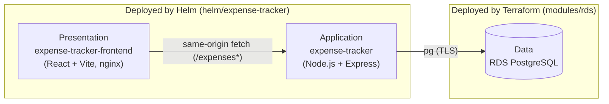
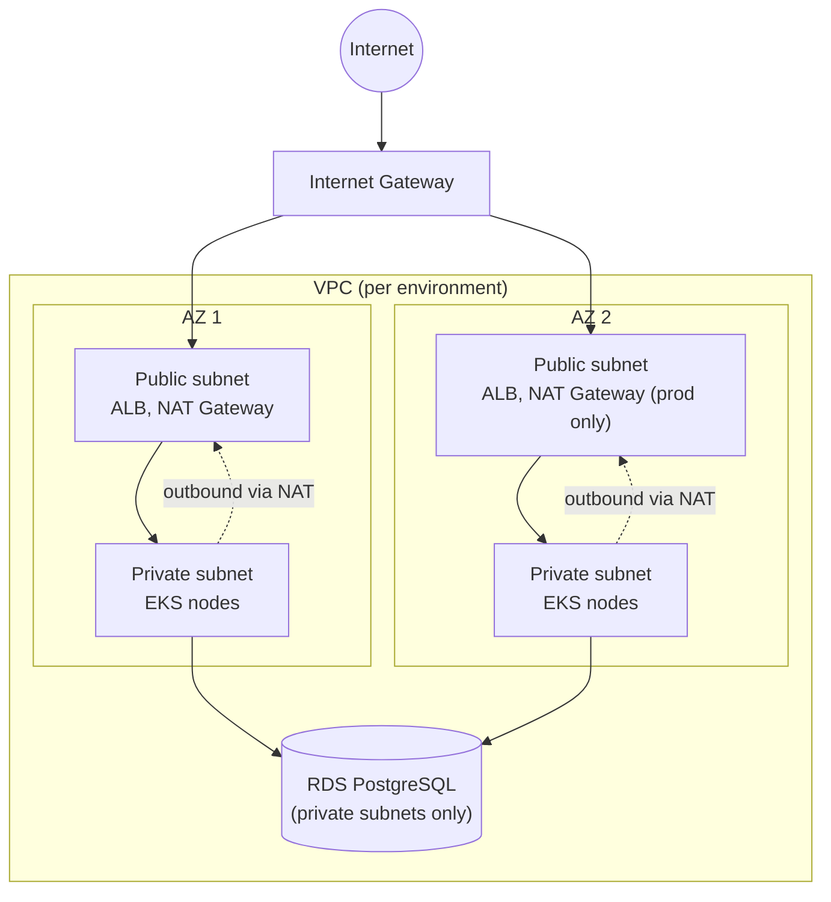

# Expense-Tracker App

Expense-Tracker is a cloud-native expense and receipt tracking platform running on Amazon EKS.
It demonstrates a complete, production-style workflow spanning infrastructure as code,
Kubernetes deployment, CI/CD automation, and observability.

---

## Table of Contents

- [Expense-Tracker App](#expense-tracker-app)
  - [Table of Contents](#table-of-contents)
  - [Platform Overview](#platform-overview)
    - [Infrastructure](#infrastructure)
    - [Application](#application)
  - [Architecture Design](#architecture-design)
    - [Compute](#compute)
    - [Data layer](#data-layer)
    - [Terraform layout](#terraform-layout)
    - [Helm chart (helm/expense-tracker)](#helm-chart-helmexpense-tracker)
  - [Networking Design](#networking-design)
    - [Per-environment layout](#per-environment-layout)
    - [Security group boundaries](#security-group-boundaries)
    - [Ingress routing](#ingress-routing)
    - [Topology](#topology)
  - [Data Flow](#data-flow)
    - [Request flow (read/write an expense)](#request-flow-readwrite-an-expense)
    - [Image Delivery Flow](#image-delivery-flow)
    - [Secret Injection Flow](#secret-injection-flow)
    - [Metrics \& Logs Flow](#metrics--logs-flow)
    - [Where data lives](#where-data-lives)
  - [Project Structure](#project-structure)
  - [Prerequisites](#prerequisites)
  - [Setup \& Deployment](#setup--deployment)
    - [1. Bootstrap remote state (once per AWS account)](#1-bootstrap-remote-state-once-per-aws-account)
    - [2. Apply an environment](#2-apply-an-environment)
    - [3. Wire up CI/CD](#3-wire-up-cicd)
    - [4. Fill in the Helm values](#4-fill-in-the-helm-values)
    - [5. First deploy](#5-first-deploy)
    - [6. Install monitoring (optional, per cluster)](#6-install-monitoring-optional-per-cluster)
  - [CI/CD Pipeline](#cicd-pipeline)
  - [Monitoring](#monitoring)
  - [Environments](#environments)
  - [Security](#security)
  - [Troubleshooting](#troubleshooting)
    - [🛠️ EKS \& AWS Provider Issues](#️-eks--aws-provider-issues)
    - [☸️ Helm \& Kubernetes Deployment](#️-helm--kubernetes-deployment)
    - [🌐 Networking \& Storage](#-networking--storage)
    - [💻 OS \& Local Environment](#-os--local-environment)
  - [Teardown](#teardown)

---

## Platform Overview

### Infrastructure

| Component | Details |
|---|---|
| **Amazon EKS 1.36** | Managed control plane, `authentication_mode = API_AND_CONFIG_MAP` (both the aws-auth ConfigMap and the newer EKS Access Entries API work) |
| **VPC** | 2 AZs, public + private subnets, NAT gateway (single for dev/stg, one per AZ for prod) |
| **EKS Managed Node Group** | Amazon Linux, capacity type and sizing vary per environment |
| **EKS-managed add-ons** | `vpc-cni`, `coredns`, `kube-proxy`, `aws-ebs-csi-driver`, `metrics-server`, `amazon-cloudwatch-observability` (`modules/eks-addons`) |
| **AWS Load Balancer Controller + Cluster Autoscaler** | Helm releases applied by Terraform (`environments/<env>/helm.tf`) |
| **IRSA everywhere** | One scoped IAM role per workload (VPC CNI, EBS CSI, Cluster Autoscaler, Load Balancer Controller, the app, CloudWatch Observability, Grafana's CloudWatch datasource); see `modules/irsa` |
| **State backend** | S3 + DynamoDB-free — `bootstrap/` is a one-time, local-state root module that creates the S3 bucket used as the backend for every environment |

### Application

| Component | Details |
|---|---|
| **`app/expense-tracker-backend`** | The API (Deployment + Service in the Helm chart) |
| **`app/expense-tracker-frontend`** | The UI (its own Deployment + Service) |
| **RDS PostgreSQL** | Private, one instance per environment, master password AWS-managed (`modules/rds`) |
| **S3 app bucket** | Versioned, encrypted, TLS-only bucket policy, holds uploaded receipts (`modules/s3-app-bucket`) |
| **Secrets Manager** | A placeholder secret per environment for miscellaneous app config (`modules/secrets-manager`); the RDS password lives in its own AWS-managed secret, not this one |
| **2 ECR repositories per environment** | `expense-platform-backend-<env>` (backend), `expense-platform-frontend-<env>` (frontend) (`modules/ecr`) |
| **Helm chart** | `helm/expense-tracker`, one release for both services |
| **CI/CD** | `.github/workflows/build-and-deploy.yml` |
| **Monitoring** | `monitoring/` (Prometheus + Grafana + CloudWatch datasource) |

---

## Architecture Design

This is a 3-tier application, split across two tools by design — not a gap, just where each tier
is deployed from:

| Tier | What | Deployed by |
|---|---|---|
| Presentation | `app/expense-tracker-frontend` (React + Vite, nginx-served) | Helm (`helm/expense-tracker`) |
| Application | `app/expense-tracker-backend` (Node.js + Express) | Helm (`helm/expense-tracker`) |
| Data | RDS PostgreSQL | Terraform (`modules/rds`) |

RDS was deliberately kept as a managed service rather than a self-hosted `StatefulSet` in the
cluster — it gives AWS-managed backups, patching, and (in prod) Multi-AZ failover for free, and
the strongest drift-detection story (`terraform plan` diffs the actual `aws_db_instance` resource
attribute-by-attribute). Self-hosting Postgres in Kubernetes would mean owning all of that
operationally, for no scaling benefit this app actually needs.



### Compute

- One EKS managed node group per environment, spanning both private subnets (`modules/eks`).
- **Namespaces**: `expense-tracker-<env>` runs the app (backend + frontend + migration Job);
  `kube-system` runs cluster add-ons; `monitoring` runs Prometheus/Grafana.
- The app's namespace is created by Terraform (`kubernetes_namespace.app`), not by Helm — see
  [Security](#security) for why.
- **Scaling**: three independent layers. Cluster Autoscaler adds/removes EC2 nodes as pod demand
  changes; a `HorizontalPodAutoscaler` per service (backend/frontend, CPU-based, disabled in dev,
  enabled in stg/prod — `helm/expense-tracker/templates/backend-hpa.yaml` /
  `frontend-hpa.yaml`) adds/removes pod replicas within the node group's capacity; the ALB and S3
  scale automatically with no configuration. RDS storage also auto-grows up to
  `rds_max_allocated_storage` as usage approaches the current limit — the one part of the stack
  that doesn't self-heal under growth otherwise.

### Data layer

- **RDS PostgreSQL** — `gp3`-backed, sizing/Multi-AZ varies per environment, security group scoped
  to the EKS node security group only (`modules/rds`).
- **S3 app bucket** — receipts stored under `<env>/receipts/`.
- **Secrets Manager** — one placeholder secret per environment; Terraform never writes to it after
  creation (`lifecycle { ignore_changes = [secret_string] }`), so the app team can populate real
  values without Terraform reverting them.
- **ECR** — two repositories per environment (see above), IMMUTABLE tags, scan-on-push, lifecycle
  policy expiring old untagged/excess-tagged images.

### Terraform layout

- **`bootstrap/`** — one-time, local-state module creating the S3 state bucket. Applied manually,
  once per AWS account, before anything else.
- **`modules/`** — reusable building blocks: `vpc`, `eks`, `eks-addons`, `irsa`, `ecr`, `rds`,
  `s3-app-bucket`, `secrets-manager`, `cloudwatch`, `ci-deployer`. `vpc` and `eks` wrap the
  `terraform-aws-modules/vpc/aws` and `terraform-aws-modules/eks/aws` registry modules.
- **`environments/{dev,stg,prod}/`** — one root module per environment; identical files, different
  `terraform.tfvars` (CIDR, NAT strategy, node/RDS sizing, log retention).

---

## Application Design

The three pieces named in the Architecture Design tiers above, in detail.

### Backend (app/expense-tracker-backend)

Node.js + Express, using `pg` for Postgres and the AWS SDK v3 for S3/Secrets Manager.

| Method | Path | Purpose |
|---|---|---|
| `POST` | `/expenses` | Create an expense (multipart form, optional receipt upload) |
| `GET` | `/expenses` | List expenses (filter by `category`/`month`) |
| `GET` | `/expenses/:id` | Get one expense, with a presigned receipt URL if uploaded |
| `PUT` | `/expenses/:id` | Update an expense, optionally replacing the receipt |
| `DELETE` | `/expenses/:id` | Delete an expense and its receipt object |
| `GET` | `/expenses/summary` | Totals grouped by category and month |
| `GET` | `/healthz` | Liveness/readiness probe target |
| `GET` | `/metrics` | Prometheus exposition format (`prom-client`) |

On boot, the app fetches its DB credentials from the RDS-managed Secrets Manager secret using its
pod's IRSA role — no database password ever touches Terraform state or a Kubernetes Secret.
Schema migrations (`src/migrate.js`) run as a Helm `post-install,post-upgrade` hook.

### Frontend (app/expense-tracker-frontend)

React 18 + Vite, built to a static bundle and served by nginx. Talks to the API with **same-origin
relative fetches** (`fetch("/expenses")`) — no API base URL or CORS configuration needed, since
both services sit behind the same ALB. Supports creating, editing, deleting, and summarizing
expenses, with receipt upload/replace.

### Helm chart (helm/expense-tracker)

One chart, one release per environment, both services:

- `backend-serviceaccount.yaml` — annotated with the app's IRSA role ARN
- `backend-configmap.yaml` — non-secret config (DB host/port, S3 bucket, region)
- `backend-deployment.yaml` / `backend-service.yaml` — backend
- `frontend-deployment.yaml` / `frontend-service.yaml` — frontend
- `ingress.yaml` — one ALB, path-split between the two Services
- `backend-migration-job.yaml` — a `post-install,post-upgrade` hook (Job specs are immutable, so a
  plain `helm upgrade` can't patch one in place once the image tag changes — the hook deletes the
  previous Job and creates a fresh one instead)

`values.yaml` holds chart defaults; `values-<env>.yaml` carries environment-specific values
(image repository/tag, replica count, IRSA role ARN, RDS endpoint, S3 bucket). See
[`helm/expense-tracker/README.md`](helm/expense-tracker/README.md) for install/upgrade commands.

---

## Networking Design

### Per-environment layout

| | dev | stg | prod |
|---|---|---|---|
| VPC CIDR | `10.0.0.0/16` | `10.1.0.0/16` | `10.2.0.0/16` |
| AZs | 2 | 2 | 2 |
| Private subnets | `10.0.0.0/19`, `10.0.32.0/19` | `10.1.0.0/19`, `10.1.32.0/19` | `10.2.0.0/19`, `10.2.32.0/19` |
| Public subnets | `10.0.64.0/19`, `10.0.96.0/19` | `10.1.64.0/19`, `10.1.96.0/19` | `10.2.64.0/19`, `10.2.96.0/19` |
| NAT gateway | single (shared) | single (shared) | one per AZ |

Each environment gets its own VPC (`modules/vpc`) — no peering or shared networking between
environments. Prod's per-AZ NAT gateways mean a single AZ outage doesn't take down all outbound
traffic (patching, ECR pulls, Secrets Manager calls); dev/stg accept that risk for lower cost.

### Security group boundaries

| Security group | Attached to | Allows inbound from |
|---|---|---|
| Cluster SG | EKS control plane | Node SG (kubelet/webhook ports) |
| Node SG | EKS worker nodes | Cluster SG (control plane), self (pod-to-pod: CoreDNS, webhooks) |
| RDS SG | RDS instance | Node SG only, on `5432` (`modules/rds`) — nothing else in the VPC, and nothing outside it, can reach the database |

### Ingress routing

One ALB per environment (AWS Load Balancer Controller, provisioned from
`helm/expense-tracker/templates/ingress.yaml`), shared by both services so the frontend can call
the API same-origin with no CORS configuration:

| Path | Routes to | Purpose |
|---|---|---|
| `/expenses*` | backend Service | REST API |
| `/healthz` | backend Service | ALB target-group health check |
| `/` (everything else) | frontend Service | Static SPA bundle |

### Topology



---

## Data Flow

### Request flow (read/write an expense)

```
Browser
  |
  |  HTTP GET /
  ▼
ALB (Ingress)
  |
  |  Rule: /*  →  frontend service
  ▼
Frontend Pod (nginx)
  |
  |  Serves static SPA bundle
  |
  |  Browser JS calls fetch /expenses* (same-origin)
  ▼
ALB (Ingress)
  |
  |  Rule: /expenses*, /healthz  →  backend service
  ▼
Backend Pod (Express)
  |
  ├─▶ Secrets Manager (IRSA)      — fetch DB credentials, no static creds
  ├─▶ RDS Postgres (pg, TLS)      — query/insert expense records
  └─▶ S3 receipts bucket (IRSA)   — upload on create, presigned URL on read
```

### Image Delivery Flow

```
GitHub Push to main
  |
  ▼
GitHub Actions
  |  test              — npm ci && npm test
  |  build-and-push    — docker build → docker push (backend + frontend)
  ▼
ECR (private)
  |  <account_id>.dkr.ecr.<region>.amazonaws.com/
  |  ├─▶ expense-platform-backend-<env>:backend-<env>-<timestamp>
  |  └─▶ expense-platform-frontend-<env>:web-<env>-<timestamp>
  ▼
deploy job                       — bumps both tags in values-<env>.yaml, commits back to main
  |
  ▼
helm upgrade --install
  |
  ├─▶ migration Job hook         — runs against RDS
  └─▶ Deployment rollout         — kubelet pulls the new images via the node's IAM role
```

### Secret Injection Flow

```
AWS Secrets Manager
  |  rds!db-<generated>                  (RDS-managed)  — { username, password }
  |  <env>/app/placeholder               (Terraform)    — misc app config
  ▼
Backend Pod (IRSA role: expense-platform-<env>-app)
  |  AWS SDK v3 GetSecretValue at boot (src/secrets.js) — no static credentials
  |  no External Secrets Operator, no Kubernetes Secret object involved
  ▼
In-memory DB credentials
  └─▶ pg connection pool (src/db.js)
```

### Metrics & Logs Flow

```
Backend Pod
  |  /metrics endpoint (prom-client)
  ▼
Prometheus (ServiceMonitor scrapes every 15s)
  |  stores in PVC (gp3, 10Gi, 15d retention)
  ▼
Grafana (Prometheus datasource)
  |  App Dashboard      — request rate, latency, errors
  |  Platform Dashboard — node CPU/memory, pod counts (built in)

EKS control plane + nodes
  |  amazon-cloudwatch-observability add-on (fluent-bit + CloudWatch agent)
  ▼
CloudWatch Logs & Container Insights
  ▼
Grafana (CloudWatch datasource, via IRSA — module.irsa_grafana_cloudwatch)
  └─▶ CloudWatch Dashboard — Logs Insights queries, cross-referenced with Prometheus metrics
```

### Where data lives

| Data | Storage | Protection |
|---|---|---|
| Expense records | RDS PostgreSQL | Private subnets only, SG scoped to node SG, AWS-managed master password |
| Receipt files | S3 app bucket | Versioned, encrypted, TLS-only bucket policy, IRSA-scoped access (no public access) |
| DB credentials | Secrets Manager (AWS-managed) | Rotated by AWS, fetched at runtime via IRSA — never written to Terraform state or a Kubernetes Secret |
| App config (non-secret) | Kubernetes ConfigMap | DB host/port, S3 bucket name, region — no credentials |

---

## Project Structure

```
DevOps-Projects/
├── bootstrap/                       # One-time: S3 state bucket (local state)
├── modules/
│   ├── vpc/                         # Wraps terraform-aws-modules/vpc/aws
│   ├── eks/                         # Wraps terraform-aws-modules/eks/aws
│   ├── eks-addons/                  # vpc-cni, coredns, kube-proxy, ebs-csi, metrics-server, cloudwatch-observability
│   ├── irsa/                        # Generic IRSA role wrapper
│   ├── ecr/                         # ECR repository + lifecycle policy
│   ├── rds/                         # RDS Postgres instance + security group
│   ├── s3-app-bucket/               # App receipts bucket
│   ├── secrets-manager/             # Placeholder secret
│   ├── cloudwatch/                  # Log groups
│   └── ci-deployer/                 # Per-environment CI IAM user (scoped ECR push + EKS access)
├── environments/
│   ├── dev/  stg/  prod/            # One root module per environment
├── app/
│   ├── expense-tracker/             # Backend (Node.js + Express)
│   └── expense-tracker-frontend/    # Frontend (React + Vite)
├── helm/
│   └── expense-tracker/             # Helm chart for both services
├── .github/
│   └── workflows/
│       └── build-and-deploy.yml     # CI/CD pipeline
└── monitoring/                      # Prometheus + Grafana (manually helm-installed)
```

---

## Prerequisites

| Tool | Notes |
|---|---|
| Terraform | >= 1.5 |
| AWS CLI | configured with credentials that can create VPC/EKS/IAM/RDS/S3/ECR/Secrets Manager/CloudWatch resources |
| kubectl | any recent version |
| Helm | >= 3 |
| Docker | for local image builds |
| Node.js | 20+ (matches the app's runtime and CI) |
| Git | GPG signing configured if you want verified commits |

## Setup & Deployment

### 1. Bootstrap remote state (once per AWS account)

```bash
cd bootstrap
# edit terraform.tfvars: replace <ACCOUNT_ID> in state_bucket_name
terraform init
terraform apply
```

Keep `bootstrap/terraform.tfstate` safe — it describes the state bucket itself, so it isn't stored
remotely.

### 2. Apply an environment

```bash
cd environments/dev
# edit terraform.tfvars and backend-dev.hcl: replace <ACCOUNT_ID>
terraform init -backend-config=backend-dev.hcl
terraform plan
terraform apply
```

This creates the VPC, EKS cluster, RDS instance, ECR repos, S3 bucket, IRSA roles, EKS add-ons,
the `ci_deployer` CI user, and the app's Kubernetes namespace.

### 3. Wire up CI/CD

Create a matching GitHub Environment (`dev`/`stg`/`prod`) and set its secrets/variables from the
`environments/<env>` Terraform outputs. See
[`.github/workflows/README.md`](.github/workflows/README.md) for the exact list and commands.

### 4. Fill in the Helm values

`helm/expense-tracker/values-<env>.yaml` needs the real `image.repository`,
`frontend.image.repository`, `serviceAccount.roleArn`, `config.dbHost`, `config.dbSecretArn`, and
`config.s3Bucket` from the same Terraform outputs — the pipeline only ever bumps image tags, not
these. See [`helm/expense-tracker/README.md`](helm/expense-tracker/README.md).

### 5. First deploy

Push to `main` (or trigger `workflow_dispatch` targeting the environment) — CI builds and pushes
both images, then runs `helm upgrade --install`.

```bash
aws eks update-kubeconfig --name expense-platform-dev --region us-east-1
kubectl get pods -n expense-tracker-dev
kubectl get ingress -n expense-tracker-dev
```

### 6. Install monitoring (optional, per cluster)

```bash
cd monitoring
# see monitoring/README.md for the full sequence
```

---

## CI/CD Pipeline

`.github/workflows/build-and-deploy.yml`, three jobs:

1. **test** — `npm ci && npm test` in `app/expense-tracker-backend`.
2. **build-and-push** — builds and pushes both images to their ECR repos, tagged
   `backend-<env>-<timestamp>` (backend) / `web-<env>-<timestamp>` (frontend).
3. **deploy** — bumps both tags in `values-<env>.yaml` with `yq`, commits the change back to
   `main`, then runs `helm upgrade --install` against the target cluster.

Triggers: push to `main` deploys to `dev` automatically; `workflow_dispatch` lets you pick
`dev`/`stg`/`prod` manually. Each environment authenticates with its own scoped, Terraform-managed
IAM user (`modules/ci-deployer`) via GitHub Environment secrets — no shared or long-lived
cross-environment credentials.

## Monitoring

Prometheus + Grafana (`kube-prometheus-stack`, manually `helm install`ed — see
[`monitoring/README.md`](monitoring/README.md)) cover both platform metrics (nodes, pods,
deployments — built-in dashboards) and application metrics (`app/expense-tracker-backend`'s `/metrics`
endpoint, scraped via a `ServiceMonitor`, visualized in a custom dashboard). Grafana also has
CloudWatch wired in as a second datasource (its own IRSA role, `module.irsa_grafana_cloudwatch`),
so CloudWatch log groups and metrics are viewable in the same place.

---

## Environments

| | dev | stg | prod |
|---|---|---|---|
| NAT gateway | single | single | one per AZ |
| Node capacity type | SPOT | ON_DEMAND | ON_DEMAND |
| Node group size (min/max/desired) | 1/3/2 | 2/4/2 | 3/10/4 |
| RDS instance class | `db.t3.micro` | `db.t3.small` | `db.r6g.large` |
| RDS storage (start → max) | 20 → 50 GiB | 20 → 50 GiB | 100 → 500 GiB |
| RDS Multi-AZ | no | no | yes |
| RDS deletion protection | no | no | yes |
| Log retention | 7 days | 14 days | 90 days |
| Frontend/backend replicas | 1 / 1 (fixed) | 2–4 (HPA) | 3–6 (HPA) |

Only `dev` has been deployed and verified end-to-end so far; `stg`/`prod` are defined but not yet
applied.

## Security

- **IRSA everywhere** — every AWS-facing workload (VPC CNI, EBS CSI, Cluster Autoscaler, Load
  Balancer Controller, the app, CloudWatch Observability, Grafana) assumes a scoped IAM role via
  its Kubernetes service account. No pod carries static AWS credentials.
- **Least-privilege CI identity** — `modules/ci-deployer` creates one IAM user per environment,
  scoped to that environment's two ECR repos and a namespace-scoped EKS Access Entry
  (`AmazonEKSEditPolicy` restricted to `expense-tracker-<env>` only — it cannot create namespaces
  or touch cluster-scoped resources).
- **RDS password never touches Terraform** — `manage_master_user_password = true` lets AWS create
  and rotate it directly in Secrets Manager.
- **TLS-only S3 bucket policies** on both the state bucket and the app bucket.
- **GPG-signed commits** on this repo.

---

## Troubleshooting

Real issues hit (and fixed) while building this out:

### 🛠️ EKS & AWS Provider Issues

**1. EKS Add-on Error (`Unsupported argument: most_recent`)**
The Problem: The `aws_eks_addon` resource does not support the `most_recent` argument in your current AWS provider version.

The Fix: Delete the `addon_version` line entirely from your code to automatically use the default version.

**2. RDS Security Group Error (`Invalid for_each argument`)**
The Problem: `for_each` requires keys to be known before deployment (at plan time), but the EKS node security group ID is only generated after the cluster is created.

The Fix: Switch from `for_each` to `count = length(var.allowed_security_group_ids)`. Terraform only needs to know the length of the list at plan time.

**3. VPC-CNI Pods Crash-Looping (`Unauthorized operation`)**
The Problem: Pods are crashing because the EKS IAM submodule generated a blank policy lacking the necessary EC2 network permissions.

The Fix: Explicitly set `vpc_cni_enable_ipv4 = true` in the submodule.

**4. Cluster Autoscaler Policy Error (`coalescelist`)**
The Problem: The IAM policy generation failed because a required variable was missing.

The Fix: Ensure you populate the `cluster_autoscaler_cluster_names` variable when setting `attach_cluster_autoscaler_policy = true`.

### ☸️ Helm & Kubernetes Deployment

**5. Helm Permission Error (`namespaces is forbidden`)**
The Problem: The CI/CD pipeline's access is restricted to a single namespace, so it lacks the cluster-wide permissions required to run `helm install --create-namespace`.

The Fix: Have Terraform (which has cluster-admin rights) create the namespace beforehand, and remove the `--create-namespace` flag from your CI pipeline.

**6. Migration Job Failure (`Invalid value: ... spec.template`)**
The Problem: Kubernetes Job templates are immutable. Every time a new deployment changes the image
tag, Helm tries to update the existing Job in place, causing a crash.

The Fix: Turn the Job into a Helm hook using the annotation `hook-delete-policy:
before-hook-creation`. This forces Helm to delete the old Job and create a fresh one on every
deploy.

### 🌐 Networking & Storage

**7. App Unreachable / Unhealthy ALB Targets**
The Problem: The AWS Load Balancer (ALB) health check defaults to `/`, but the application returned a `404` at that root path, marking the pods unhealthy. Additionally, a shared frontend
config inherited this broken default.
The Fix:
1. Add the annotation `alb.ingress.kubernetes.io/healthcheck-path: /healthz` to point to a valid
   health endpoint.
2. Add a matching `/healthz` stub to the frontend's Nginx configuration so it returns a `200 OK`.

**8. PVCs Stuck Pending (Prometheus/Grafana)**
The Problem: The legacy `gp2` StorageClass uses an old AWS EBS plugin that is no longer supported
in newer EKS versions.
The Fix: Deploy and switch to a modern, CSI-driver-backed `gp3` StorageClass.

### 💻 OS & Local Environment

**9. Git Bash Path Corruption (`/healthz` becomes `C:/Program Files/...`)**
The Problem: When running `kubectl` on Windows via Git Bash, the terminal automatically converts
forward slashes into Windows file paths.
The Fix: Prefix your command or set your environment variable with `MSYS_NO_PATHCONV=1` to disable
automatic path conversion.

---

## Teardown

```bash
# Monitoring
helm uninstall kube-prometheus-stack -n monitoring
kubectl delete namespace monitoring

# App
helm uninstall expense-tracker -n expense-tracker-dev

# Infrastructure (per environment, then bootstrap last)
cd environments/dev && terraform destroy
cd ../../bootstrap && terraform destroy
```

PVCs (and their underlying EBS volumes) aren't deleted automatically by `helm uninstall` — check
`kubectl get pvc -A` and delete them manually first if you want a clean teardown.
